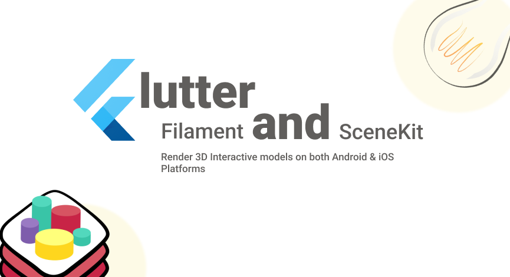
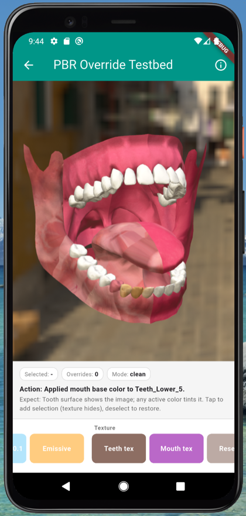
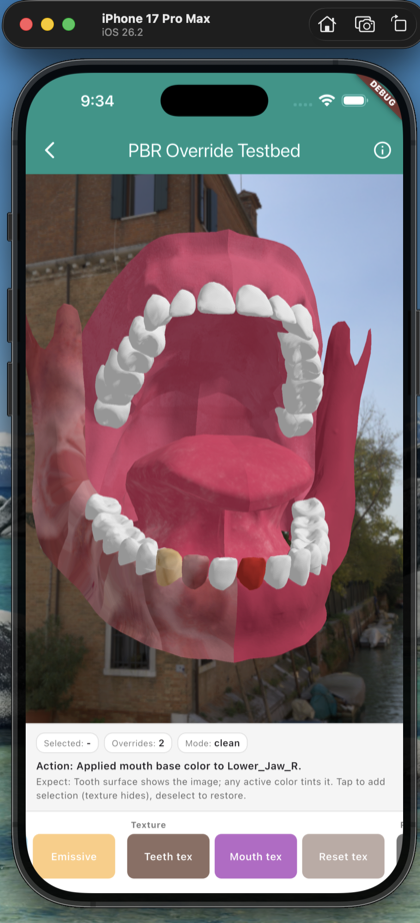

# interactive_3d [](https://pub.dev/packages/interactive_3d)

<p align="center">
  
</p>

<p align="center">
  <a href="https://pub.dev/packages/interactive_3d/score"></a>
  <a href="https://pub.dev/packages/interactive_3d/score"></a>
  <a href="https://opensource.org/licenses/MIT"></a>
  
</p>

<p align="center">
  A Flutter plugin for rendering and interacting with 3D models (<code>.glb</code> / <code>.gltf</code>),
  powered by <a href="https://google.github.io/filament/">Google Filament</a> on Android and
  <a href="https://developer.apple.com/scenekit/">SceneKit</a> on iOS. Open source, MIT licensed.
</p>

> Built with healthcare in mind: let users explore a 3D model, tap any part of the body, and describe a complaint on a specific region or the whole body. The same building blocks fit medical visualizers, mechanical exploded views, and product configurators.

## Demo

Android and iOS:

<p float="left">
  
  
  
  
</p>

## Contents

- [Features](#features)
- [Platform support](#platform-support)
- [Installation](#installation)
- [Quick start](#quick-start)
- [Loading models](#loading-models)
- [Generate IBL and skybox](#generate-ibl-and-skybox)
- [Runtime PBR material overrides](#runtime-pbr-material-overrides)
- [Runtime base color textures](#runtime-base-color-textures)
- [Contributing](#contributing)
- [Maintainer](#maintainer)

## Features

**Rendering**
- Load `.glb` and `.gltf` models from assets or a network URL.
- Image-based lighting (IBL) and skybox from `.ktx` files.
- Solid background color that skips the skybox while keeping IBL lighting quality.

**Interaction**
- Rotate, pan, and tap gestures out of the box.
- Tap parts (named entities) to select them, and read the selection back in your app.
- Preselect parts by name and give them custom highlight colors.
- Toggle visibility of part groups, and set a default zoom.
- Persistent selection cache with a configurable cache color.
- Ordered selection rules with bidirectional and tied-group support.

**Materials and runtime styling**
- Runtime PBR overrides: change color, metallic, roughness, and emissive per part, independent of selection.
- Runtime base color textures: upload a PNG or JPEG onto any part from bytes, with no GLB rebuild.

**Performance**
- Device-adaptive quality on Android (MSAA, supersampling, and render-quality auto-tuning).
- Adaptive frame pacing that saves battery while the model is idle.

## Platform support

| Platform | Minimum | Render engine |
| --- | --- | --- |
| Android | API 24 | Google Filament (Texture API) |
| iOS | 12.0 | SceneKit + GLTFSceneKit |

Requires Flutter `>= 3.44.0` and Dart `>= 3.6.0`.

## Installation

```bash
flutter pub add interactive_3d
```

Then import it:

```dart
import 'package:interactive_3d/interactive_3d.dart';
```

## Quick start

Drop in a `.glb` model and a lighting environment, and you have an interactive 3D view:

```dart
Interactive3d(
  modelPath: 'assets/models/heart.glb',
  iblPath: 'assets/models/venetian_crossroads_2k_ibl.ktx',
  skyboxPath: 'assets/models/venetian_crossroads_2k_skybox.ktx',
  onSelectionChanged: (selectedEntities) {
    // selectedEntities is a List<EntityData> of the parts the user tapped.
  },
)
```

Add your model files under `assets/models` and declare them in `pubspec.yaml`. A `.glb` model is self-contained. A `.gltf` model needs its companion `.bin` file in the same folder, and any textures placed in a sub-folder such as `assets/models/textures`, listed via the `resources` parameter (keep the `.bin` first in that list). See the example app for a complete asset layout.

## Loading models

<details open>
<summary><b>From a .gltf model</b></summary>

```dart
Interactive3d(
  // Solid background skips the skybox but keeps IBL lighting.
  solidBackgroundColor: [0.92, 0.92, 0.92, 1.0],
  modelPath: 'assets/models/Tooth-2.gltf',
  // IBL and skybox are the background environments.
  iblPath: 'assets/models/venetian_crossroads_2k_ibl.ktx',
  skyboxPath: 'assets/models/venetian_crossroads_2k_skybox.ktx',
  // iOS background environment from an HDR file.
  iOSBackgroundEnvPath: 'assets/models/san_giuseppe_bridge_4k.hdr',
  // Preselect parts by entity name.
  preselectedEntities: ["Teeth_1", "Teeth_2", "Lower_Jaw"],
  // Selection color (RGBA), default is green.
  selectionColor: [1.0, 0.0, 0.0, 1.0],
  // Default zoom, default is 1.0.
  defaultZoom: 1.5,
  // Custom color for a specific selected or preselected part.
  patchColors: [
    PatchColor(
      name: "Hard_Plate_L",
      color: [0.41, 0.35, 0.51, 1.0],
    ),
    // ...
  ],
  // glTF companion files. Keep the .bin first.
  resources: [
    'scene.bin',
    'textures/mouth_baseColor.png',
    'textures/mouth_metallicRoughness.png',
    'textures/mouth_normal.png',
    'textures/teeth_baseColor.png',
    'textures/teeth_metallicRoughness.png',
    'textures/teeth_normal.png',
  ],
  onSelectionChanged: (selectedEntities) {
    setState(() {
      _selectedEntities = selectedEntities;
    });
  },
)
```

</details>

<details>
<summary><b>From a .glb model</b></summary>

A `.glb` is self-contained, so `resources` is not needed:

```dart
Interactive3d(
  solidBackgroundColor: [0.92, 0.92, 0.92, 1.0],
  modelPath: 'assets/models/heart.glb',
  iblPath: 'assets/models/venetian_crossroads_2k_ibl.ktx',
  skyboxPath: 'assets/models/venetian_crossroads_2k_skybox.ktx',
  iOSBackgroundEnvPath: 'assets/models/san_giuseppe_bridge_4k.hdr',
  preselectedEntities: ["Chamber", "Artery"],
  selectionColor: [1.0, 0.0, 0.0, 1.0],
  defaultZoom: 1.5,
  patchColors: [
    PatchColor(
      name: "Hard_Plate_L",
      color: [0.41, 0.35, 0.51, 1.0],
    ),
    // ...
  ],
  onSelectionChanged: (selectedEntities) {
    setState(() {
      _selectedEntities = selectedEntities;
    });
  },
)
```

</details>

<details>
<summary><b>From a network URL</b></summary>

```dart
Interactive3d(
  modelUrl: 'https://modelviewer.dev/shared-assets/models/Astronaut.glb',
  iblUrl: 'https://example/your_ibl.ktx',
  skyboxUrl: 'https://example/your_skybox.ktx',
  iOSBackgroundEnvPath: 'assets/models/san_giuseppe_bridge_4k.hdr',
  preselectedEntities: ["Chamber", "Artery"],
  selectionColor: [1.0, 0.0, 0.0, 1.0],
  defaultZoom: 1.5,
  patchColors: [
    PatchColor(
      name: "Hard_Plate_L",
      color: [0.41, 0.35, 0.51, 1.0],
    ),
    // ...
  ],
  onSelectionChanged: (selectedEntities) {
    setState(() {
      _selectedEntities = selectedEntities;
    });
  },
)
```

</details>

See the example app for complete, runnable usage.

## Generate IBL and skybox

IBL captures the lighting environment from an HDR image, providing indirect lighting for reflections and ambient light. The skybox defines the scene background, simulating the surrounding environment.

1. Get a high-quality HDR image from [Poly Haven](https://polyhaven.com/) or a similar source.
2. Download the latest Filament build for your OS from the [Filament releases](https://github.com/google/filament/releases), and add its `bin` directory to your shell `PATH` so you can run `cmgen` directly. `cmgen` is Filament's command-line tool for generating IBL data and skybox textures from HDR images.
3. Generate the `.ktx` files:

```bash
cmgen --format=ktx --deploy=output_file_name output_directory
```

For example:

```bash
cmgen --format=ktx --deploy=san_guiseppe ~/Downloads/san_giuseppe_bridge_4k.hdr
```

## Runtime PBR material overrides

> Added in v2.1.0

Change color, metallic, roughness, or emissive on any part at runtime, independent of the selection system. GLB textures are preserved: the color tints them rather than replacing them.

```dart
final controller = Interactive3dController();

Interactive3d(
  controller: controller,
  modelPath: 'assets/models/Tooth-3.glb',
  iblPath: 'assets/models/giuseppe_bridge_4k_ibl.ktx',
  skyboxPath: 'assets/models/giuseppe_bridge_4k_skybox.ktx',
)

// Apply at runtime (for example, from a button tap):
await controller.setEntityMaterial(
  name: 'Tooth_7',
  color: [0.85, 0.15, 0.15, 1.0], // RGBA, tints the GLB texture red
  metallic: 0.0,
  roughness: 0.9,
);

// Restore one part to its GLB original:
await controller.resetEntityMaterial('Tooth_7');

// Or reset every override at once:
await controller.resetAllMaterialOverrides();
```

Apply overrides on model load by passing them to the widget. Useful when restoring state on app reopen:

```dart
Interactive3d(
  modelPath: 'assets/models/Tooth-3.glb',
  initialMaterialOverrides: [
    MaterialOverride(name: 'Tooth_3', color: [0.85, 0.15, 0.15, 1.0]),
    MaterialOverride(name: 'Tooth_7', metallic: 0.9, roughness: 0.2),
  ],
)
```

Successive calls on the same part merge: pass only the fields you want to change, and the rest keep their value. Selection still wins visually while active, and deselecting restores the override.

Overrides are not persisted by the plugin. Store them in your own state layer (SharedPreferences, Hive, SQLite, or a remote database) and pass them back via `initialMaterialOverrides` when you build the widget.

## Runtime base color textures

> Added in v2.2.0

Upload a PNG or JPEG onto any part at runtime as its base color texture, with no GLB rebuild. Pass the encoded bytes, and the plugin decodes them natively. An active color override tints the uploaded texture, the same way it tints a GLB texture.

<p align="center">
  
  
</p>
<p align="center"><em>A photo applied to teeth at runtime. Android (left) and iOS (right).</em></p>

```dart
import 'package:flutter/services.dart' show rootBundle;

final bytes = (await rootBundle.load('assets/textures/wood.png')).buffer.asUint8List();

// Apply at runtime (for example, from a swatch tap):
await controller.setEntityTexture(name: 'Tooth_7', bytes: bytes);

// Remove the texture, keeping any color/metallic/roughness override:
await controller.resetEntityTexture('Tooth_7');

// Or remove every uploaded texture at once:
await controller.resetAllEntityTextures();
```

Apply textures on model load by passing them to the widget, the same way as overrides:

```dart
Interactive3d(
  modelPath: 'assets/models/Tooth-3.glb',
  initialEntityTextures: [
    EntityTexture(name: 'Tooth_7', bytes: woodBytes),
  ],
)
```

The texture merges into the same per-part override as color and PBR factors: setting a color after a texture keeps the texture, and the reverse holds too. Selection still wins visually while active, and the texture returns on deselect. `resetEntityMaterial` clears everything on the part, including the texture.

Two things to know:

- The part's mesh must have UV coordinates. A part authored without UVs has nowhere to map the image.
- Base color images are treated as sRGB, and images larger than 2048px on the longest side are downsampled to bound GPU memory.

Like overrides, textures are not persisted by the plugin. Re-apply them from your own state layer after the model loads.

## Contributing

Contributions are welcome. If you find a bug or want a feature, open an issue, and feel free to raise a PR. You can also reach me on [LinkedIn](https://www.linkedin.com/in/muhammad-adnan-developer/) about any issue you open, whether or not you plan to contribute.

This plugin keeps improving over time, and your contribution is invaluable.

## Maintainer

Created and actively maintained by **Muhammad Adnan**.

- GitHub: [@AdnanKhan45](https://github.com/AdnanKhan45)
- LinkedIn: [@MuhammadAdnan](https://www.linkedin.com/in/muhammad-adnan-developer/)
- Instagram: [@dev.adnankhan](https://www.instagram.com/dev.adnankhan/)
- YouTube: [@eTechViral](https://www.youtube.com/c/eTechViral)
